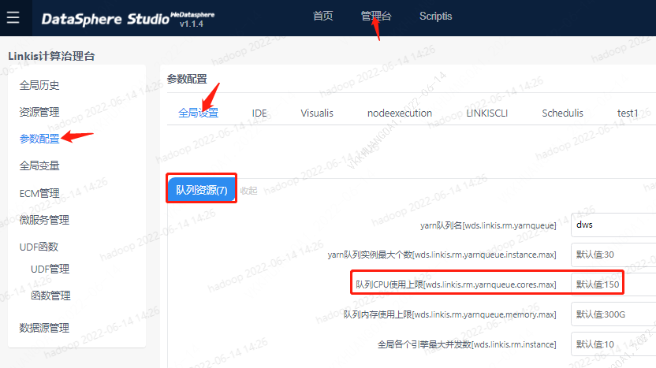
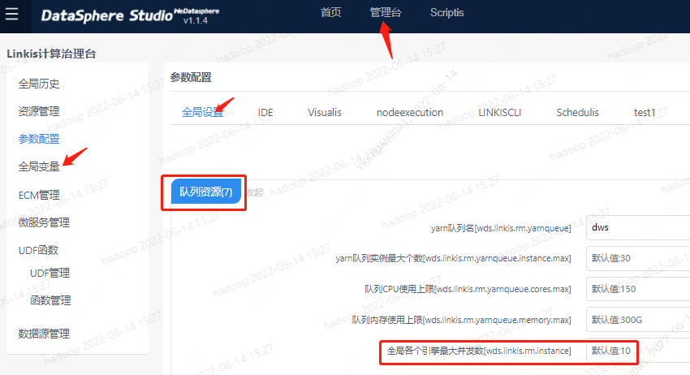
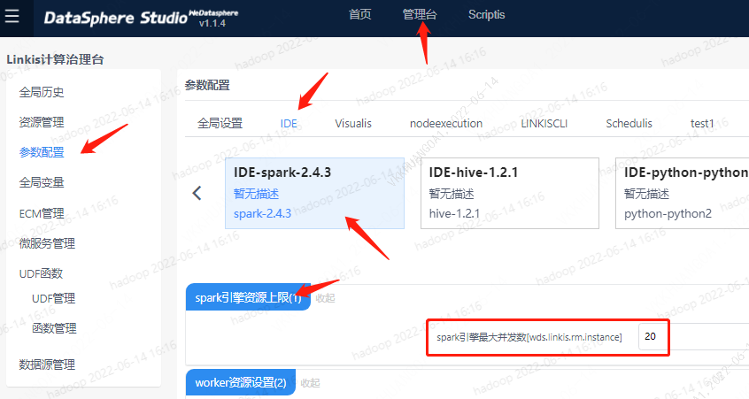
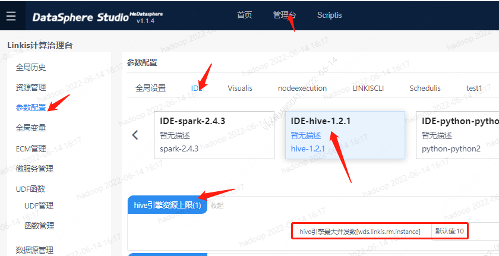
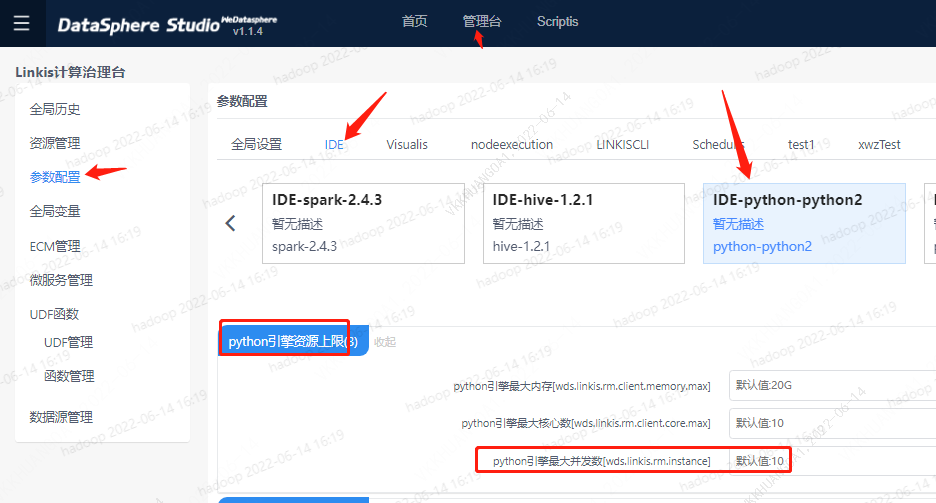
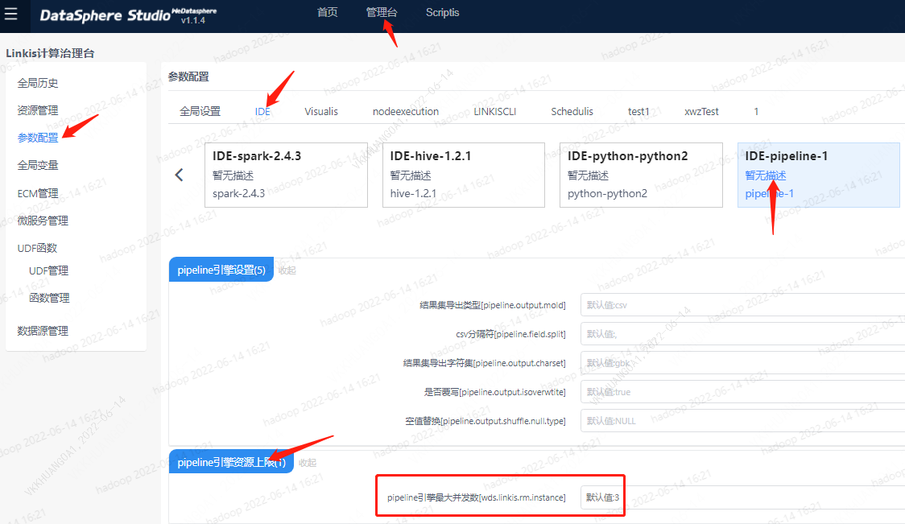
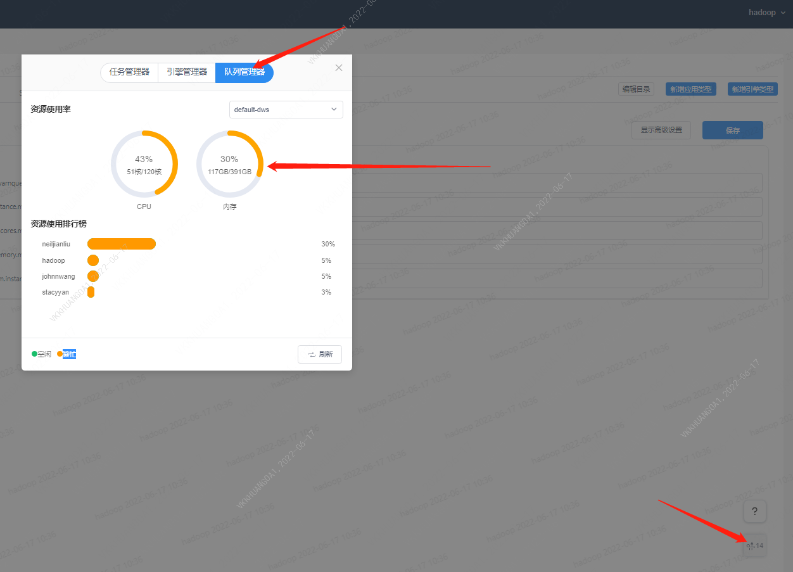
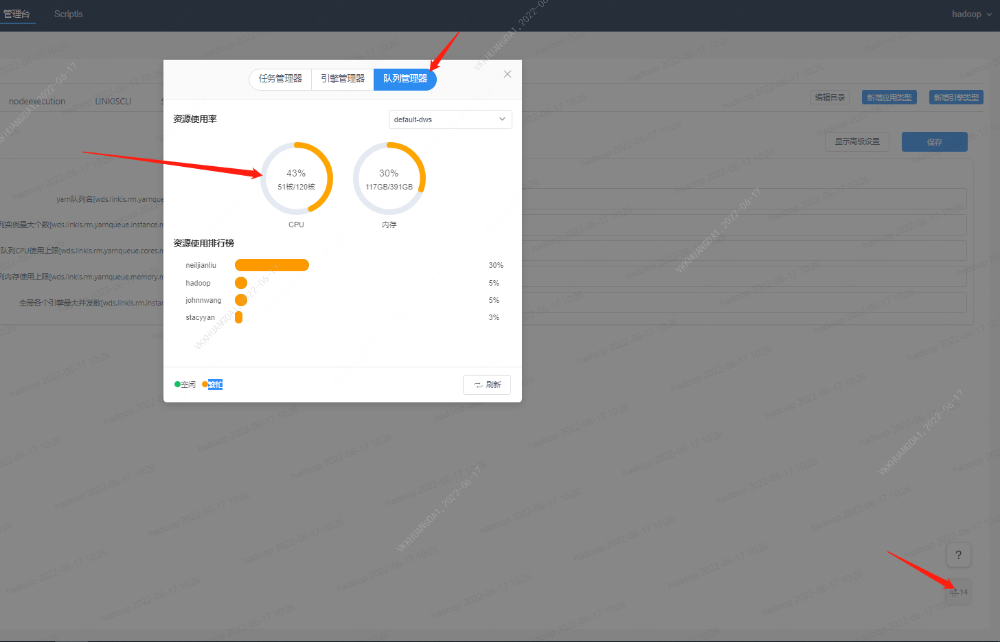
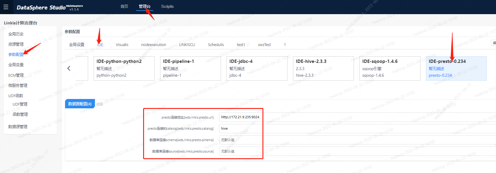
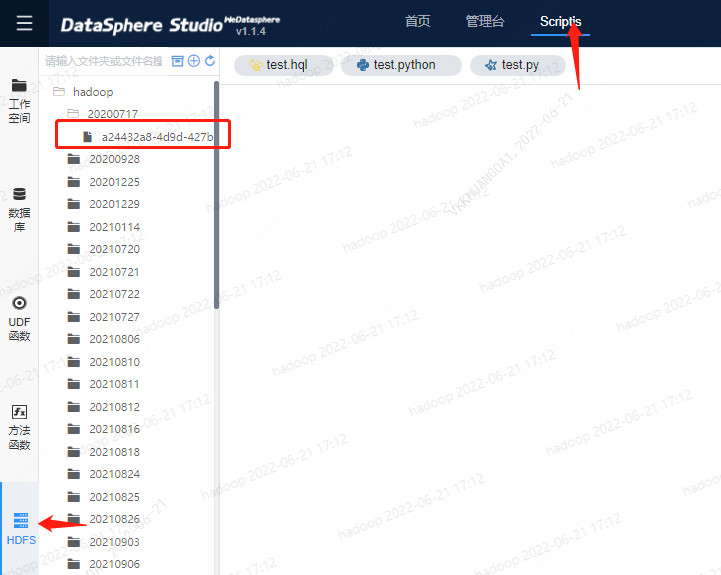

#### Error code 01001

**error description**

An error occurs during task execution:error code : 01001，error msg : Your task is not routed to the background ECM，Please contact the administrator
>The em of labels

**Reason 1**

Your task is not routed to the background ECM

**Solution 1**
1. Check whether the tenant label is correct

2. If yes, contact the administrator
---------------------------------
#### Error code 01002

**error description**

An error occurs during task execution:error code : 01002，error msg : The Linkis service load is too high. Contact the administrator to expand the capacity
>Unexpected end of file from server

**Reason 1**

The linkis service load is too high, resulting in abnormal service connection

**Solution 1**

Please contact the administrator

---------------------------------

#### Error code 01003

**error description**

An error occurs during task execution:error code : 01003，error msg : The linkis service load is too high. Please contact the administrator for capacity expansion
>failed to ask linkis Manager Can be retried SocketTimeoutException

**Reason 1**

The link service load is too high, resulting in service connection timeout

**Solution 1**

Contact administrator

---------------------------------

#### Error code 01004

**error description**

An error occurs during task execution:error code : 01004，error msg : The engine is killed at startup,Please contact the administrator
>[0-9]+ Killed

**Reason 1**

The engine was killed at startup because the machine load was too high

**Solution 1**
1. you can choose to retry
2. or contact the administrator

---------------------------------

#### Error code 01005

**error description**

An error occurs during task execution:error code : 01005，error msg : Request Yan to get the queue information and retry for 2 times still failed, please contact the administrator
>Failed to request external resourceClassCastException

**Reason 1**

Failed to request Yan to obtain queue information. This is caused by a configuration problem

**Solution 1**

Please contact the administrator

---------------------------------

#### Error code 01101

**error description**

An error occurs during task execution:error code : 01101，error msg : ECM resources are insufficient, please contact the administrator for capacity expansion
>ECM resources are insufficient

**Reason 1**

Due to insufficient server resources, possibly during peak hours

**Solution 1**
1. you can retry the task
2. or contact the administrator
---------------------------------

#### Error code 01102

**error description**

An error occurs during task execution:error code : 01102，error msg : ECM memory resources are insufficient. Please contact the administrator for capacity expansion
>ECM memory resources are insufficient

**Reason 1**

Insufficient server memory resources

**Solution 1**
1. you can retry the task
2. or contact the administrator
---------------------------------

#### Error code 01103

**error description**

An error occurs during task execution:error code : 01103，error msg : ECM CPU resources are insufficient. Please contact the administrator for capacity expansion
>ECM CPU resources are insufficient

**Reason 1**

Insufficient server CPU resources

**Solution 1**
1. you can retry the task
2. or contact the administrator
---------------------------------

#### Error code 01104

**error description**

An error occurs during task execution:error code : 01104，error msg : Instance resources are insufficient. Please contact the administrator for capacity expansion
>ECM Insufficient number of instances

**Reason 1**

Insufficient server instance resources

**Solution 1**
1. you can retry the task
2. or contact the administrator
---------------------------------

#### Error code 01105

**error description**

An error occurs during task execution:error code : 01105，error msg : The machine is out of memory. Please contact the administrator for capacity expansion
>Cannot allocate memory

**Reason 1**

Server machine out of memory

**Solution 1**

1. you can retry the task

2. or contact the administrator
---------------------------------

#### Error code 12001

**error description**

An error occurs during task execution:error code : 12001，error msg : The queue CPU resource is insufficient. You can adjust the number of spark actuators
>Queue CPU resources are insufficient

**Reason 1**

The queue CPU resource is insufficient, exceeding the limit you set

**Solution 1**

- Open the DSS platform and click management console -- parameter configuration -- ide -- spark -- display advanced settings -- Walker engine resource settings (2) -- adjust the number of concurrent executors [spark.executor.instances]
  

- Or adjust the upper limit of queue resource usage on the management console -- parameter configuration -- global settings
---------------------------------

#### Error code 12002

**error description**

An error occurs during task execution:error code : 12002，error msg : The queue memory resources are insufficient. You can adjust the number of spark actuators
>Insufficient queue memory

**Reason 1**

The queue memory resource is insufficient, which exceeds the queue memory resource value you set

**Solution 1**
- Open the DSS platform and click management console -- parameter configuration -- ide -- spark -- display advanced settings -- Walker engine resource settings (2) -- adjust the number of concurrent executors [spark.executor.instances]
  

- Or adjust the upper limit of queue resource usage on the management console - parameter configuration - global settings
---------------------------------

#### Error code 12003

**error description**

An error occurs during task execution:error code : 12003，error msg : The number of queue instances exceeds the limit
>Insufficient number of queue instances

**Reason 1**

The number of queue instances exceeds the limit

**Solution 1**

- Open the DSS platform and click management console - parameter configuration - global settings - queue resources - maximum number of yarn queue instances [wds.links.rm.yarnqueue.instance.max]
- 

**Remarks**

Users are not recommended to modify the global settings at will. If necessary, please contact the operation and maintenance department before modifying. Non global setting parameters, which can be modified by the user

---------------------------------

#### Error code 12004

**error description**

An error occurs during task execution:error code : 12004，error msg : Global drive memory usage limit, lower drive memory can be set
>Drive memory resources are insufficient

**Reason 1**

Global drive memory exceeds maximum

**Solution 1**
- Open the DSS platform and click management console - parameter configuration - global settings - queue resources - maximum number of yarn queue instances [wds.links.rm.yarnqueue.instance.max]
  

**Solution 2**

- If the queue is available and the number of application instances is too low, you can contact the administrator to set

**Remarks**

Users are not recommended to modify the global settings at will. If necessary, please contact the operation and maintenance department before modifying. Non global setting parameters, which can be modified by the user

---------------------------------

#### Error code 12005

**error description**

An error occurs during task execution:error code : 12005，error msg : If the maximum number of global drive CPUs is exceeded, idle engines can be cleaned up
>Drive core resources are insufficient

**Reason 1**

The number of global drive CPUs exceeds the maximum

**Solution 1**

- Open the DSS platform and click management console - parameter configuration - global settings - queue resources - upper limit of queue CPU [wds.links.rm.yarnqueue.cores.max]
  

**Solution 2**

- Clean up idle engines

**Remarks**

Users are not recommended to modify the global settings at will. If necessary, please contact the operation and maintenance department before modifying. Non global setting parameters, which can be modified by the user

---------------------------------

#### Error code 12006

**error description**

An error occurs during task execution:error code : 12006，error msg : If the maximum number of concurrent engines is exceeded, idle engines can be cleaned up
>Insufficient number of instances

**Reason 1**

Maximum engine concurrency exceeded

**Solution 1**

- Modify the configuration and global configuration: open the DSS platform and click management console - parameter configuration - global settings - queue resources - global maximum concurrency of each engine [wds.links.rm.instance]
  
- spark engine
  
- hive engine
  
- python engine
  
- pipeline engine
  

**Remarks**

Users are not recommended to modify the global settings at will. If necessary, please contact the operation and maintenance department before modifying. Non global setting parameters, which can be modified by the user

---------------------------------

#### Error code 12008

**error description**

An error occurs during task execution:error code : 12008，error msg : Exception in getting the yarn queue information. It may be that the yarn queue you set does not exist
>获取Yarn队列信息异常

**Reason 1**

Exception in getting Yan queue information

**Solution 1**

- If the cluster is normal and the user queue is configured incorrectly:
- Linkis management console / parameter configuration > global settings >yarn queue name [wds.linkis.rm.yarnqueue]
   

**Solution 2**

- If the cluster is a new cluster, first check the cluster configuration of linkismanager
  >Hadoop cluster address: http://ip:8088/cluster
  >
  >yarn cluster address:http://ip:8888/cluster/scheduler
>
**Remarks**

Users are not recommended to modify the global settings at will. If necessary, please contact the operation and maintenance department before modifying. Non global setting parameters, which can be modified by the user

---------------------------------

#### Error code 12009

**error description**

An error occurs during task execution:error code : 12009，error msg : Session creation failed. The%s queue does not exist. Please check whether the queue settings are correct
>queue (\S+) is not exists in YARN

**Reason 1**

The queue does not exist. Please check whether the queue settings are correct

**Solution 1**

The user contacts the administrator to confirm whether the queue is correct

---------------------------------

#### Error code 12010

**error description**

An error occurs during task execution:error code : 12010，error msg : The cluster queue memory resources are insufficient. You can contact people in the group to release resources
>Insufficient cluster queue memory

**Reason 1**

Insufficient cluster queue memory resources

**Solution 1**

Check whether the resource memory is full. The user contacts the personnel in the group to release the resource, or applies for queue expansion

---------------------------------

#### Error code 12011

**error description**

An error occurs during task execution:error code : 12011，error msg : Cluster queue CPU resources are insufficient. You can contact people in the group to release resources
>Insufficient cluster queue cpu

**Reason 1**

Insufficient cluster queue CPU resources

**Solution 1**

Check whether the resource CPU is full. The user contacts the personnel in the group to release the resource, or applies for queue expansion

---------------------------------

#### Error code 12013

**error description**

An error occurs during task execution:error code : 12013，error msg : Insufficient resources cause the engine to timeout. You can retry the task
>wait for DefaultEngineConn

**Reason 1**

Starting the engine timed out due to insufficient resources

**Solution 1**

The user retries the task. If it occurs repeatedly, please contact the administrator for troubleshooting

---------------------------------

#### Error code 12014

**error description**

An error occurs during task execution:error code : 12014，error msg : The request engine timed out, which may be caused by insufficient queue resources. Please try again
>wait for engineConn initial timeout

**Reason 1**

Request engine timed out

**Solution 1**

The user retries the task. If it occurs repeatedly, please contact the administrator for troubleshooting

---------------------------------

#### Error code 13001

**error description**

An error occurs during task execution:error code : 13001，error msg : Java process memory overflow, it is recommended to optimize the script content
>OutOfMemoryError

**Reason 1**

Java process memory overflow

**Solution 1**

- The user tries to increase the memory configuration of the Java management side. If it occurs repeatedly, please contact the administrator for troubleshooting
- Modify the configuration, open the DSS platform, and click management console -- parameter configuration -- ide -- idespark -- spark engine resource settings (2) -- spark engine memory [spark.driver.memory]
- 

---------------------------------

#### Error code 13002

**error description**

An error occurs during task execution:error code : 13002，error msg : The use of resources is too large. Please tune SQL or increase resources

>Container killed by YARN for exceeding memory limits

**Reason 1**

Use resources too large

**Solution 1**

- Increase the memory of the executor in the management console or in the task submission
- Modify the configuration, open the DSS platform, and click management console -- parameter configuration -- ide -- idspark -- worker resource settings (2) -- worker memory size [spark.executor.memory]
- 
---------------------------------

#### Error code 13003

**error description**

An error occurs during task execution:error code : 13003，error msg : The use of resources is too large. Please tune SQL or increase resources

>read record exception

**Reason 1**

Use resources too large

**Solution 1**

- After confirming with the administrator, the user can increase the memory of the executor in the management console or in the task submission
- Modify the configuration, open the DSS platform, and click management console -- parameter configuration -- ide -- idspark -- worker resource settings (2) -- worker memory size [spark.executor.memory]
- 
---------------------------------

#### Error code 13004

**error description**

An error occurs during task execution:error code : 13004，error msg : The engine exited unexpectedly, which may be caused by excessive use of resources

>failed because the engine quitted unexpectedly

**Reason 1**

Unexpected engine exit

**Solution 1**

Contact the administrator for troubleshooting

---------------------------------

#### Error code 13005

**error description**

An error occurs during task execution:error code : 13005，error msg : Spark app exit may be caused by complex tasks

>Spark application has already stopped

**Reason 1**

Spark app exit may be caused by complex tasks

**Solution 1**

- The user tries to increase the memory configuration of the Java management side. If it occurs repeatedly, please contact the administrator for troubleshooting
- Modify the configuration, open the DSS platform, and click management console -- parameter configuration -- ide -- idespark -- spark engine resource settings (2) -- spark engine memory [spark.driver.memory]
- 

**Solution 2**

- After confirming with the administrator, the user can increase the memory of the executor in the management console or in the task submission
- Modify the configuration, open the DSS platform, and click management console -- parameter configuration -- ide -- idspark -- worker resource settings (2) -- worker memory size [spark.executor.memory]
- 

---------------------------------

#### Error code 13006

**error description**

An error occurs during task execution:error code : 13006，error msg : Spark context exits, which may be caused by complex tasks

>Spark application has already stopped

**Reason 1**

Spark context exits, which may be caused by complex tasks

**Solution 1**

- The user tries to increase the memory configuration of the Java management side. If it occurs repeatedly, please contact the administrator for troubleshooting
- Modify the configuration, open the DSS platform, and click management console -- parameter configuration -- ide -- idespark -- spark engine resource settings (2) -- spark engine memory [spark.driver.memory]
- 

**Solution 2**

- After confirming with the administrator, the user can increase the memory of the executor in the management console or in the task submission
- Modify the configuration, open the DSS platform, and click management console -- parameter configuration -- ide -- idspark -- worker resource settings (2) -- worker memory size [spark.executor.memory]
- 
---------------------------------

#### Error code 13007

**error description**

An error occurs during task execution:error code : 13007，error msg : Pyspark child process exited unexpectedly, which may be caused by complex tasks

>Pyspark process  has stopped

**Reason 1**

Pyspark child process exited unexpectedly, which may be caused by complex tasks

**Solution 1**

- The user tries to increase the memory configuration of the Java management side. If it occurs repeatedly, please contact the administrator for troubleshooting
- Modify the configuration, open the DSS platform, and click management console -- parameter configuration -- ide -- idespark -- spark engine resource settings (2) -- spark engine memory [spark.driver.memory]
- 
---------------------------------

#### Error code 21001

**error description**

An error occurs during task execution:error code : 21001，error msg : Session creation failed, user%s cannot submit application to queue:%s, please contact the person who provided the queue to you

>User (\S+) cannot submit applications to queue (\S+)

**Reason 1**

Session creation failed, user%s cannot submit application to queue

**Solution 1**

The user queue does not have permission. Please check whether the queue configuration is wrong or apply for queue permission

---------------------------------

#### Error code 21002

**error description**

An error occurs during task execution:error code : 21002，error msg : Failed to create Python interpreter, please contact the administrator

>initialize python executor failed

**Reason 1**

Failed to create Python interpreter, please contact the administrator

**Solution 1**

Contact the operation and maintenance personnel for troubleshooting

---------------------------------

#### Error code 21003

**error description**

An error occurs during task execution:error code : 21003，error msg : Failed to create stand-alone Python interpreter, please contact the administrator

>PythonSession process cannot be initialized

**Reason 1**

Failed to create Python interpreter, please contact the administrator

**Solution 1**

Contact the operation and maintenance personnel for troubleshooting

---------------------------------

#### Error code 22001

**error description**

An error occurs during task execution:error code : 22001，error msg : %S has no permission to access. Please apply for permission to open the data table. Please contact your data management personnel

>Permission denied:\s*user=[a-zA-Z0-9_]+,\s*access=[A-Z]+\s*,\s*inode="([a-zA-Z0-9/_\.]+)

**Reason 1**

Unauthorized access

**Solution 1**

- Database table permission needs to be applied to
---------------------------------

#### Error code 22003

**error description**

An error occurs during task execution:error code : 22003，error msg : The checked database table has no permission

>Authorization failed:No privilege

**Reason 1**

Unauthorized access

**Solution 1**

- Database table permission needs to be applied to

---------------------------------

#### Error code 22004

**error description**

An error occurs during task execution:error code : 22004，error msg : The user%s does not exist on the machine. Please confirm whether you have applied for relevant permissions

>user (\S+) does not exist

**Reason 1**

Unauthorized access

**Solution 1**

- User bill of lading application authority
---------------------------------

#### Error code 22005

**error description**

An error occurs during task execution:error code : 22005，error msg : The user does not exist on the machine. Please confirm whether you have applied for relevant permissions

>engineConnExec.sh: Permission denied

**Reason 1**

Unauthorized access

**Solution 1**

- User bill of lading application authority
---------------------------------

#### Error code 22006

**error description**

An error occurs during task execution:error code : 22006，error msg : The user does not exist on the machine. Please confirm whether you have applied for relevant permissions

>at com.sun.security.auth.UnixPrincipal

**Reason 1**

Unauthorized access

**Solution 1**

- User bill of lading application authority
---------------------------------

#### Error code 22007

**error description**

An error occurs during task execution:error code : 22007，error msg : The user does not exist on the machine. Please confirm whether you have applied for relevant permissions

>LoginException: java.lang.NullPointerException: invalid null input: name

**Reason 1**

Unauthorized access

**Solution 1**

- User bill of lading application authority
---------------------------------

#### Error code 22008

**error description**

An error occurs during task execution:error code : 22008，error msg : The user does not exist on the machine. Please confirm whether you have applied for relevant permissions

>User not known to the underlying authentication module

**Reason 1**

Unauthorized access

**Solution 1**

- User bill of lading application authority
---------------------------------

#### Error code 30001

**error description**

An error occurs during task execution:error code : 30001，error msg : Library exceeds limit

>is exceeded

**Reason 1**

Library exceeds limit

**Solution 1**

Users clean up data by themselves

**Solution 2**

Apply for database expansion

---------------------------------

#### Error code 31001

**error description**

An error occurs during task execution:error code : 31001，error msg : User active kill task

>is killed by user

**Reason 1**

User active kill task

**Solution 1**

- If it is confirmed that the user has not actively killed, please contact the operation and maintenance personnel for troubleshooting
---------------------------------

#### Error code 31002

**error description**

An error occurs during task execution:error code : 31002，error msg : The enginetypelabel you submitted does not have a corresponding engine version

>EngineConnPluginNotFoundException

**Reason 1**

Enginetypelabel has no corresponding engine version

**Solution 1**

- The user checks whether the enginetypelabel passed is correct. If it is correct, please contact the operation and maintenance personnel for troubleshooting
- Inspection method of the operation and maintenance personnel: the lib/links-engineconn-plugins/ on the linkis ECP node is the local cache of all available engine plug-ins. This is not possible because the corresponding version of the engine is not available, or there are other abnormal format files in the engine file, such as Bak, you shouldn't have put zip. Zip, etc
---------------------------------

#### Error code 41001

**error description**

An error occurs during task execution:error code : 41001，error msg : The database%s does not exist. Please check whether the referenced database is correct

>Database '([a-zA-Z_0-9]+)' not found

**Reason 1**

Database %s does not exist

**Solution 1**

- User checks whether the database exists and permissions
- >show databases

---------------------------------

#### Error code 41001

**error description**

An error occurs during task execution:error code : 41001，error msg : The database%s does not exist. Please check whether the referenced database is correct

>Database does not exist: ([a-zA-Z_0-9]+)

**Reason 1**

Database %s does not exist

**Solution 1**

- User checks whether the database exists and permissions
- >show databases

---------------------------------

#### Error code 41003

**error description**

An error occurs during task execution:error code : 41003，error msg : The field%s does not exist. Please check whether the referenced field is correct

>cannot resolve '`(.+)`' given input columns

**Reason 1**

Field %s does not exist

**Solution 1**

- User checks whether the field exists
>desc tabl_name
---------------------------------

#### Error code 41003

**error description**

An error occurs during task execution:error code : 41003，error msg : The field%s does not exist. Please check whether the referenced field is correct

>Column '(.+)' cannot be resolved

**Reason 1**

Field %s does not exist

**Solution 1**

- User checks whether the field exists
>desc tabl_name
---------------------------------

#### Error code 41003

**error description**

An error occurs during task execution:error code : 41003，error msg : The field%s does not exist. Please check whether the referenced field is correct

> Invalid table alias or column reference '(.+)':

**Reason 1**

Field %s does not exist

**Solution 1**

- User checks whether the field exists
>desc tabl_name
---------------------------------

#### Error code 41004

**error description**

An error occurs during task execution:error code : 41004，error msg : Partition field%s does not exist. Please check whether the referenced table is a partition table or the partition field is incorrect

>Partition spec \{(\S+)\} contains non-partition columns

**Reason 1**

Partition field %s does not exist

**Solution 1**

- The user checks whether the partition field is filled in correctly

---------------------------------

#### Error code 41004

**error description**

An error occurs during task execution:error code : 41004，error msg : Partition field%s does not exist. Please check whether the referenced table is a partition table or the partition field is incorrect

>table is not partitioned but partition spec exists:\{(.+)\}

**Reason 1**

Partition field %s does not exist

**Solution 1**

- The user checks whether the partition field is filled in correctly

---------------------------------

#### Error code 41004

**error description**

An error occurs during task execution:error code : 41004，error msg : The path corresponding to the table does not exist. Please contact your data manager

>Path does not exist: viewfs

**Reason 1**

Partition path does not exist

**Solution 1**

- Please try refresh table XXX, or the kill engine runs again, but there are still exceptions. Please contact the data management personnel for troubleshooting

---------------------------------

#### Error code 41004

**error description**

An error occurs during task execution:error code : 41004，error msg : Field%s does not exist, please check whether the referenced table%s is a partition table or the partition field is incorrect

>([a-zA-Z_0-9]+) is not a valid partition column in table ([`\.a-zA-Z_0-9]+)

**Reason 1**

Field %s does not exist

**Solution 1**

- The user checks whether the partition field is filled in correctly

---------------------------------

#### Error code 41005

**error description**

An error occurs during task execution:error code : 41005，error msg : File %s does not exist

>Caused by:\s*java.io.FileNotFoundException

**Reason 1**

File %s does not exist

**Solution 1**

- Please try refresh table XXX, or the kill engine runs again, but there are still exceptions. Please contact the data management personnel for troubleshooting

---------------------------------

#### Error code 42003

**error description**

An error occurs during task execution:error code : 42003，error msg : Unknown function%s, please check whether the function referenced in the code is correct

>Undefined function: '(\S+)'

**Reason 1**

Error in referenced function

**Solution 1**

- If it is a UDF, please check the function. If it is a public function, please contact the operation and maintenance personnel for troubleshooting
- udf address

---------------------------------

#### Error code 42003

**error description**

An error occurs during task execution:error code : 42003，error msg : Unknown function%s, please check whether the function referenced in the code is correct

>Invalid function '(\S+)'

**Reason 1**

Error in referenced function

**Solution 1**

- If it is a UDF, please check the function. If it is a public function, please contact the operation and maintenance personnel for troubleshooting
- udf address

---------------------------------

#### Error code 42004

**error description**

An error occurs during task execution:error code : 42004，error msg : There is a name conflict in the field%s, please check whether there is a field with the same name in the sub query

>Ambiguous column Reference '(\S+)' in subquery

**Reason 1**

Name conflict in field %s

**Solution 1**

- User checks whether there is a duplicate name field

---------------------------------

#### Error code 42004

**error description**

An error occurs during task execution:error code : 42004，error msg : There is a name conflict in the field%s, please check whether there is a field with the same name in the sub query

>Reference '(\S+)' is ambiguous

**Reason 1**

Name conflict in field %s

**Solution 1**

- User checks whether there is a duplicate name field

---------------------------------

#### Error code 42005

**error description**

An error occurs during task execution:error code : 42005，error msg : The field%s must specify a table or subquery alias. Please check the source of the field

>Column '(\S+)' Found in more than One Tables/Subqueries

**Reason 1**

Field does not specify a table

**Solution 1**

- User added field source

---------------------------------

#### Error code 42006

**error description**

An error occurs during task execution:error code : 42006，error msg : The table%s already exists in the database. Please delete the corresponding table and try again

>Table already exists

**Reason 1**

Table %s already exists in the database

**Solution 1**

- The user needs to clean up the table and try again

---------------------------------

#### Error code 42006

**error description**

An error occurs during task execution:error code : 42006，error msg : Table %s already exists in the database，Please delete the corresponding table and try again

>AnalysisException: (S+) already exists

**Reason 1**

Table %s already exists in the database

**Solution 1**

- The user needs to clean up the table and try again

---------------------------------

#### Error code 42006

**error description**

An error occurs during task execution:error code : 42006，error msg : Table %s already exists in the database，Please delete the corresponding table and try again

>Table (\S+) already exists

**Reason 1**

Table %s already exists in the database

**Solution 1**

- The user needs to clean up the table and try again

---------------------------------

#### Error code 42006

**error description**

An error occurs during task execution:error code : 42006，error msg : Table %s already exists in the database，Please delete the corresponding table and try again

>Table or view '(\S+)' already exists in database '(\S+)'

**Reason 1**

Table %s already exists in the database

**Solution 1**

- The user needs to clean up the table and try again

---------------------------------

#### Error code 42007

**error description**

An error occurs during task execution:error code : 42007，error msg : The number of fields in the inserted target table does not match, please check the code!

>requires that the data to be inserted have the same number of columns as the target table

**Reason 1**

Insert target table field quantity mismatch

**Solution 1**

- User check code

---------------------------------

#### Error code 42008

**error description**

An error occurs during task execution:error code : 42008，error msg : Data type does not match, please check the code!

>due to data type mismatch: differing types in

**Reason 1**

data type mismatch

**Solution 1**

- User check code

---------------------------------

#### Error code 42009

**error description**

An error occurs during task execution:error code : 42009，error msg : The reference of field%s is incorrect. Please check whether the field exists!

>Invalid column reference (S+)

**Reason 1**

Incorrect reference to field %s

**Solution 1**

- User checks whether the field exists

---------------------------------

#### Error code 42010

**error description**

An error occurs during task execution:error code : 42010，error msg : Failed to extract data for field %s

>Can't extract value from (S+): need

**Reason 1**

Failed to extract data for field %s

**Solution 1**

- Check whether the selected field is incorrect

---------------------------------

#### Error code 42012

**error description**

An error occurs during task execution:error code : 42012，error msg : Group by position 2 is not in the select list, please check the code!

>GROUP BY position (S+) is not in select list

**Reason 1**

The field of group by is not in the select list

**Solution 1**

- User check code

---------------------------------

#### Error code 42014

**error description**

An error occurs during task execution:error code : 42014，error msg : Insert data does not specify target table field%s, please check the code!

>Cannot insert into target table because column number/types are different '(S+)'

**Reason 1**

The inserted data does not correspond to the fields of the target table

**Solution 1**

- User check code

---------------------------------

#### Error code 42016

**error description**

An error occurs during task execution:error code : 42016，error msg : UDF function does not specify a parameter, please check the code!

>UDFArgumentException Argument expected

**Reason 1**

UDF function does not specify full parameters

**Solution 1**

- User check code

---------------------------------

#### Error code 42017

**error description**

An error occurs during task execution:error code : 42017，error msg : Aggregate function%s cannot be written in group by, please check the code!

>aggregate functions are not allowed in GROUP BY

**Reason 1**

Aggregate function%s cannot be written in group by, please check the code!

**Solution 1**

- User check code

---------------------------------

#### Error code 43007

**error description**

An error occurs during task execution:error code : 43007，error msg : Pyspark execution failed, possibly due to syntax error or stage failure

>Py4JJavaError: An error occurred

**Reason 1**

Syntax error or stage failure

**Solution 1**

- If it is a syntax error, you need to check the code for modification
- If the stage fails, you can choose to retry

---------------------------------

#### Error code 43011

**error description**

An error occurs during task execution:error code : 43011，error msg : Export excel table exceeds the maximum limit of 1048575

>Invalid row number

**Reason 1**

Data volume exceeds the limit of a single sheet

**Solution 1**

- Reduce the amount of data to export, or export to CSV format

---------------------------------

#### Error code 43040

**error description**

An error occurs during task execution:error code : 43040，error msg : Presto query must specify data source and Library Information

>Schema must be specified when session schema is not set

**Reason 1**

Data source configuration error

**Solution 1**

- Check management console Presto data source configuration
- Modify the configuration, open the DSS platform, and click management console -- parameter configuration -- ide -- idepresto -- data source configuration
- 

---------------------------------

#### Error code 46001

**error description**

An error occurs during task execution:error code : 46001，error msg : Import file address not found:%s

>java.io.FileNotFoundException: (\S+) \(No such file or directory\)

**Reason 1**

file does not exist

**Solution 1**

- Please check the workspace, or check whether the files in the HDFS directory exist
- 

---------------------------------

#### Error code 46002

**error description**

An error occurs during task execution:error code : 46002，error msg : Exception of temporary file directory permission when exporting to excel

>java.io.IOException: Permission denied(.+) at org.apache.poi.xssf.streaming.SXSSFWorkbook.createAndRegisterSXSSFSheet

**Reason 1**

Abnormal file directory or insufficient file read / write permission

**Solution 1**

- Please confirm that the file has read-write permission. If there is any abnormality, please contact the operation and maintenance personnel for handling

---------------------------------

#### Error code 46003

**error description**

An error occurs during task execution:error code : 46003，error msg : Unable to create directory while exporting file:%s

>java.io.IOException: Mkdirs failed to create (\S+) (.+)

**Reason 1**

Unable to create directory

**Solution 1**

- Contact the operation and maintenance personnel for troubleshooting

---------------------------------

#### Error code 46004

**error description**

An error occurs during task execution:error code : 46004，error msg : Error importing module. The system does not have a%s module. Please contact the operation and maintenance personnel to install it

>ImportError: No module named (S+)

**Reason 1**

The system does not have a %s module

**Solution 1**

- Contact the operation and maintenance personnel for troubleshooting

---------------------------------

#### Error code 91002

**error description**

An error occurs during task execution:error code : 91002，error msg : The proxy user does not exist. Please check whether you have applied for a platform layer (BDP or bdap) user

>failed to change current working directory ownership

**Reason 1**

user does not exist

**Solution 1**

- The user can apply for bill of lading after checking whether it has been applied

---------------------------------

#### Error code 91003

**error description**

An error occurs during task execution:error code : 91003，error msg : Please check whether the submitting user has the authority of the proxy user in wtss, whether there are special characters in the proxy user, whether the proxy user is used incorrectly, whether the user exists at the OS level, and whether the user is set as the proxy user in the system settings

>没有权限执行当前任务

**Reason 1**

User does not have permission

**Solution 1**

- The user can apply for bill of lading after checking whether it has been applied

---------------------------------

#### Error code 91006

**error description**

An error occurs during task execution:error code : 91006，error msg : There is a problem with your user initialization. Please contact the administrator

>java: No such file or directory

**Reason 1**

User initialization failed

**Solution 1**

- If the bill of lading has been issued, contact the operation and maintenance personnel for handling; otherwise, the bill of lading DM - big data service - user bill of landing application authority

